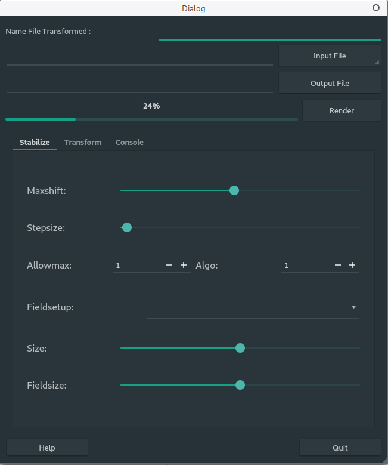
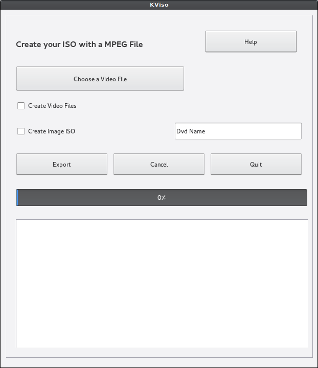

# Mockups
Here a repository for several mockups mainly in Multimédia category.
The purpose of this mockups is to save them on a location (other my computers) and test news features (using QT), news design. It is just like an idea, a draft written on the fly.
Perhaps (and probably), they won't be more developped. They are at different levels i.e just a draft, a bit more developped, etc...
You'll find too some mockups done for the Openshot Qt Project.
Feel free to contact me if you like or not or if I'm not going enough far in my idea and  vision about a software.

Now, come in the right subject. You'll find a mockup of :
* a tiny tool for stablize video using Transcode tool
* a splashscreen for Openshot
* a cover designer
* a quick launcher for Openshot
* a video converter for Openshot (a set of files)
* etc...

Some screenshots
----------------

    

    

    

Another word, all this files are proctected and covered by the GPL v3.
